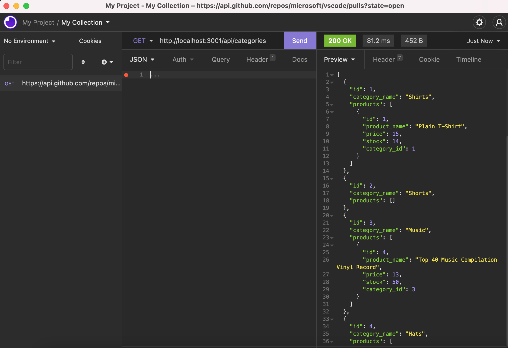

# E-Commerce-Platform

This is the back end of an e-commerce site. Enjoy!

## Welcome to my E-Commerce Platform

This e-commerce backend api uses Express.js and Sequelize to interact ith MySQL Database to create a great e-commerce backend application. In the demo linked below, I demonstrate its capabilites which include successfully creating, updating, and deleting data all in one easy to use database. Enjoy!

### VIDEO DEMO

- Enjoy a video walkthrough of my backend e-commerce platform here:

  [E-Commerce Platform VIDEO DEMO](https://watch.screencastify.com/v/XvfAWtxIHObi1O55LsJC)

### PREVIEW

- 
